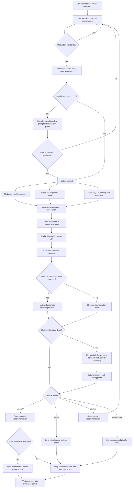

# User Flow Chart - AI-Assisted Prescribing Access Assistant

```mermaid
flowchart TD
    A[Clinician enters room and starts visit] --> B[Live recording captures conversation]
    B --> C{Medication mentioned?}
    C -- No --> B
    C -- Yes --> D[Transcript detects likely medication intent]
    D --> E{Confidence high enough?}
    E -- No --> F[Show lightweight confirm prompt in desktop side panel]
    F --> G{Clinician confirms medication?}
    G -- No --> B
    G -- Yes --> H[Gather context]
    E -- Yes --> H

    H --> H1[Medication and formulation]
    H --> H2[Payer and diagnosis context]
    H --> H3[Formulary, PA, routing, and cost data]
    H1 --> I[Generate executability assessment]
    H2 --> I
    H3 --> I

    I --> J[Show medication in desktop side panel]
    J --> K[Display High or Medium or Low]
    K --> L[Show one-sentence rationale]
    L --> M{More than one medication discussed?}
    M -- Yes --> N[List medications in chronological order]
    M -- No --> O[Show single medication card]
    N --> P{Clinician clicks into detail?}
    O --> P

    P -- No --> Q{Clinician action}
    P -- Yes --> R[Show detailed drivers and 2 to 3 alternatives with reasoning]
    R --> S[Optional patient-ready talking points]
    S --> Q

    Q -- Accept --> T[Save accepted recommendation]
    Q -- Reject --> U[Save rejection and optional reason]
    Q -- Dismiss --> V[Close current recommendation]
    Q -- Save for later --> W[Store recommendation for revisit]

    T --> X{EHR integration available?}
    X -- Yes --> Y[Sync as draft or reviewed update to EHR]
    X -- No --> Z[Keep recommendation and reasoning in app]
    U --> Z
    V --> B
    W --> Z
    Y --> AA[Visit continues with clinician in control]
    Z --> AA
```
